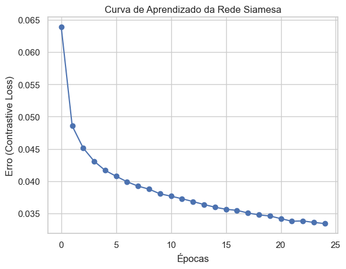
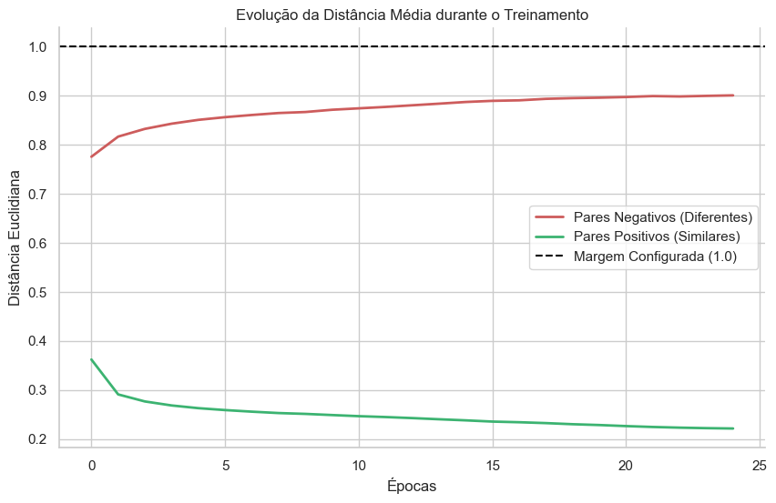
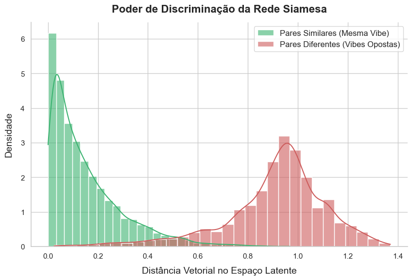
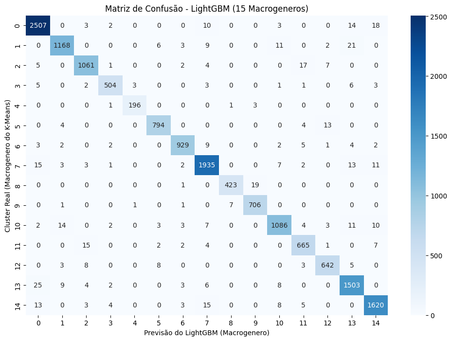
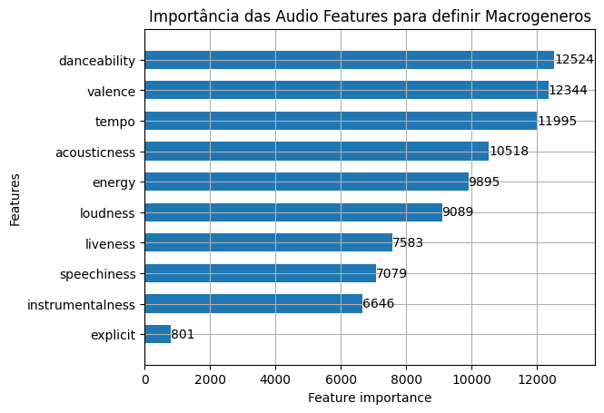
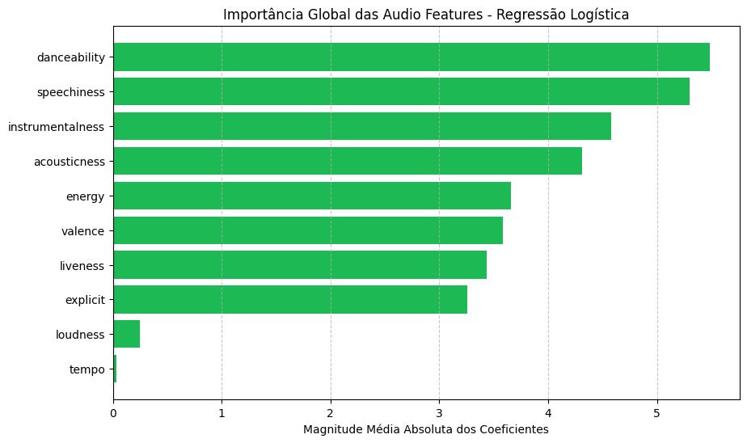

# Recfy: Sistema de Recomendação de Músicas do Spotify

Este repositório contém o projeto da disciplina de Introdução ao Machine Learning (IML). O objetivo central do projeto é desenvolver um **Sistema de Recomendação de Músicas do Spotify** inteligente, que sugere faixas baseadas em similaridade de atributos de áudio (*audio features*) e gênero musical.

O sistema é dividido em um back-end construído em Python com FastAPI, responsável por servir os modelos de Machine Learning, e um front-end interativo desenvolvido em Angular.

## Objetivo

O projeto visa criar um motor de recomendação capaz de:
1. Buscar músicas conhecidas no banco de dados e retornar as faixas mais semelhantes.
2. Lidar com **novas músicas** (não presentes na base) inferindo suas características através de Redes Siamesas para gerar *embeddings*. Apesar desse recursos estar implementado, nosso sistema usa apenas músicas presentes na base devido uma limitação do endpoint de busca de features da API do Spotify, o qual foi descontinuado.
3. Permitir filtragem de recomendações por gênero musical, garantindo que as sugestões sigam a mesma "vibe" ou estilo da música original.
4. Comparar e utilizar diferentes algoritmos de classificação e aprendizado de representação para otimizar os resultados.

## Estrutura do Projeto

O repositório está organizado nas seguintes pastas principais:

- `backend/`: Código fonte da API em Python (FastAPI). Responsável por gerenciar as requisições, carregar os modelos treinados em memória RAM e processar a lógica de busca e recomendação.
- `frontend/`: Aplicação web construída com Angular. Interface visual interativa onde o usuário pode buscar músicas, visualizar atributos e conferir as recomendações.
- `notebooks/`: Contém os Jupyter Notebooks utilizados durante a fase de pesquisa, análise exploratória de dados, *tunning* de hiperparâmetros e treinamento de todos os modelos de Machine Learning testados.
- `data/`: Contém os conjuntos de dados (*datasets*) utilizados para treinar e avaliar os modelos.

## Modelos de Machine Learning Treinados

Durante a etapa de experimentação (visível na pasta `notebooks`), testamos e otimizamos diversos modelos. O sistema em produção adota uma arquitetura híbrida de modelos:

- **Redes Siamesas (Siamese Networks)**: Essenciais para o tratamento de músicas fora da base (*out-of-vocabulary*). A rede foi treinada para aprender a gerar *embeddings* a partir das *audio features* (danceability, energy, etc.), mapeando músicas similares para locais próximos no espaço vetorial.
   - Nosso motor de busca de recomendações interno é um modelo K-Nearest Neighbors (KNN) com distância de cosseno, o que faz sentido uma vez que a rede siamesa foi treinada para gerar embeddings que minimizam essa distância entre músicas similares. 

- **LightGBM & Regressão Logística**: Atuam de maneira hierárquica, funcionando como classificadores roteadores e especialistas. Eles predizem os clusters ou macro-gêneros de uma música, auxiliando a refinar o escopo (filtro) das recomendações.
- **K-Nearest Neighbors (KNN) & Random Forest**: Foram modelos explorados na fase de desenvolvimento como modelo de experimentação, entretanto na aplicação final decidimos por manter apenas o LightGBM e a Regressão Logística como principais modelos de classificação. 

## Como Executar o Projeto

### Pré-requisitos
- Python 3.9 ou superior
- Node.js e npm

### Back-end
1. Navegue até a pasta raiz do back-end: `cd backend`
2. (Opcional, mas recomendado) Crie e ative um ambiente virtual:
   - Windows: `python -m venv venv` e `venv\Scripts\activate`
   - Linux/Mac: `python3 -m venv venv` e `source venv/bin/activate`
3. Instale as dependências listadas: `pip install -r requirements.txt`
4. Crie um arquivo `.env` com as credenciais do Spotify (`SPOTIPY_CLIENT_ID` e `SPOTIPY_CLIENT_SECRET`).
5. Execute a API: `uvicorn main:app --reload` (A API estará rodando em `http://localhost:8000`).

### Front-end
1. Navegue até a pasta do front-end: `cd frontend`
2. Instale as dependências: `npm install`
3. Inicie o servidor de desenvolvimento: `npm start` ou `ng serve`
4. Acesse a aplicação no navegador em `http://localhost:4200`.

## Resultados e Conclusão

A integração desses diversos modelos demonstrou ótimos resultados. Ao separar o processo em classificação de gênero e cálculo contínuo de similaridade espacial, o sistema gera recomendações satisfatórias.

Entretanto, vale ressaltar que durante o treinamento dos nossos modelos, encaramos a dificuldade associada a grande similaridade dos gêneros presentes no dataset, o que por vezes fazia com que o classificador de gênero atribuísse um gênero a uma música de outro gênero, gerando assim recomendações que não eram necessariamente as mais adequadas.

Além disso, gêneros musicais não são construções puramente matemáticas, eles são influenciados por fatores culturais, sociais e históricos que não são capturados pelas *audio features*, o que por vezes fazia com que o classificador de gênero atribuísse um gênero a uma música de outro gênero, gerando assim recomendações que não eram necessariamente as mais adequadas.

Uma maneira de mitigar essa dificuldade foi a utilização de um modelo de aprendizado não supervisionado previamente a execução de todos os modelos para termos uma coluna no nosso dataset que indicasse a "família" da música. Com essa abordagem, conseguimos resultados melhores na classificação, gerando uma métrica melhor para o treinamento da rede siamesa, a qual pôde validar melhor se músicas eram similares ou diferentes.

### Graficos dos modelos e métricas

#### Rede Siamesa

A primeira métrica utilizada para analisar o modelo de rede siamesa foi a sua curva de Loss. Note que apenas para 25 épocas já conseguimos diminuir o erro pela metade.

A segunda métrica utilizada para analisar o modelo de rede siamesa foi a distância média de pares similares e diferentes no espaço vetorial. O ideal é que a distância média de pares diferentes cresça ao longo do treinamento, enquanto que a de pares semelhantes diminua.

A terceira métrica utilizada para analisar o modelo de rede siamesa foi o seu poder de discriminação de distâncias. O objetivo era avaliar se o modelo era capaz de separar pares similares e diferentes no espaço vetorial. Como pode ser visto no gráfico abaixo, quanto menor a distância entre os pares, maiores as chances deles serem similares.

---

Para os modelos de classificação (LightGBM e Regressão Logística), observamos seu desepenho principal na classificação do cluster abstrato. Para tal utilizamos as métricas de f1-score, que resume de maneira eficaz a acurácia, precisão e recall, e além disso, optamos por utilizar a matriz de confusão e a importância das features para analisar os modelos.

A matriz de confusão consiste em um gráfico que indica quantos samples de uma classe foram classificados corretamente e quantos foram classificados como outras classes. Sendo assim, os acertos estão concentrados na diagonal principal, enquanto os erros de classificação estão mais distantes. Nos gráficos abaixo, podemos observar que o LightGBM possui maior precisão em relação a Regressão Logística, uma vez que ele consegue classificar corretamente uma maior quantidade de samples.

#### LightGBM

O modelo de LightGBM apresentou um **f1-score em 0.97** de 1.0

#### Regressão Logística

O modelo de Regressão Logística apresentou um **f1-score em 0.94** de 1.0

